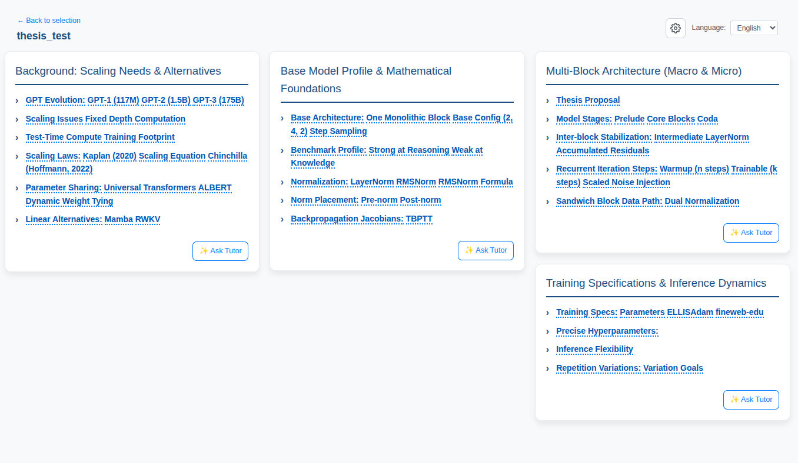
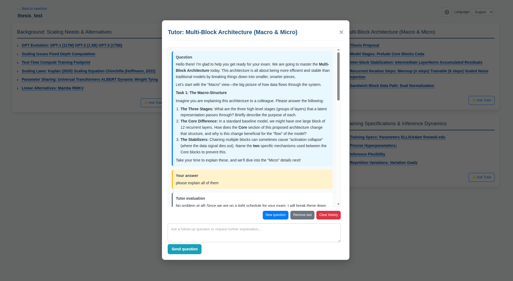
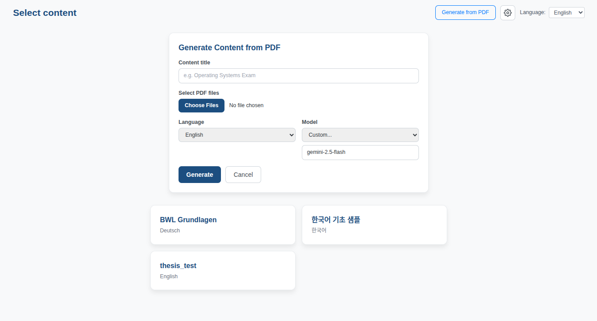
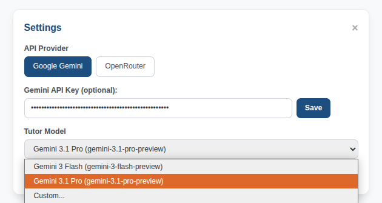

# AI Tutor

## Quick start

```bash
cd ai_tutor_react
npm i && npm run dev   # runs on http://localhost:5173
```

Paste a free [Gemini API key](https://aistudio.google.com/apikey) (or OpenRouter key) in the settings.

## What it does

- **Automatic multi-step information extraction from PDF(s):** information gets extracted from uploaded pdfs into structured format, automatically added to the available study topics
- **Tutoring loop:** a per-topic AI tutor asks exam-style questions, grades your answers with structured corrections
- **Language switching and provider selection:** UI in German, English, Japanese or Korean; Gemini or OpenRouter as backend with selectable tutor model



**Tutor session**



**Generate content from PDFs**



**Settings**



## Implementation notes

- React 18 + TypeScript + Vite + Tailwind
- small Hono (Node) API for file-based persistence and the server-side PDF to content pipeline
- Streaming uses a hand-rolled parser for Gemini's chunked JSON output (no SDK)
- model output rendered as sanitized markdown
- API keys live only in the browser's `localStorage`.
